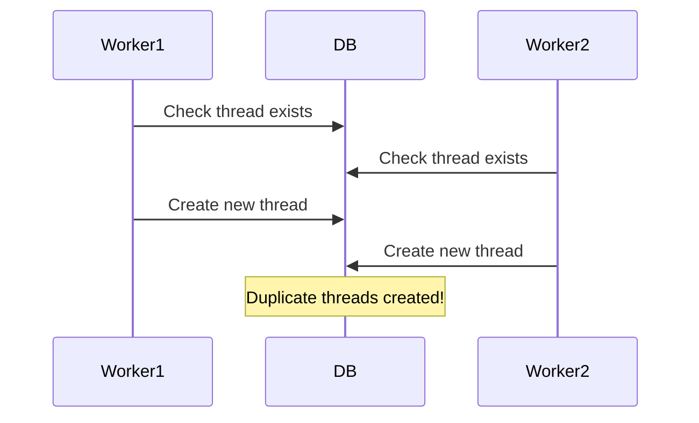
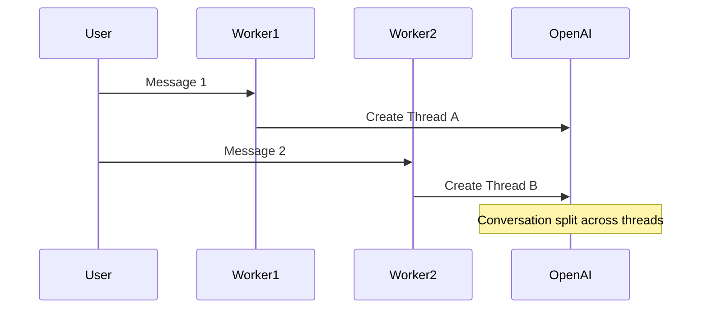

---
#issue
---

Issue: WhatsApp Repeated or Duplicate Message Handling: This indicates WhatsApp is sending multiple POST requests for the **same** message or status update, and your code is storing the ID once, then detecting duplicates on subsequent requests.

> Some degree of duplication is expected with WhatsApp status notifications and delivery confirmations, but the volume in the logs suggests you may be getting these quite rapidly—even though there’s only one user. It could be normal (WhatsApp retries) or excessive if it’s happening many times for the exact same message ID in rapid succession.


Multiple processes/workers are running simultaneously ie Pid 1 & 2


### ToDos to Resolve the Issue:
- [ ] Implement proper structured logging

#### Worker Race Conditions
In your application, Gunicorn (a Python web server) is using multiple workers to handle requests. Here's how it works:
~~~
                   ┌─── Worker 1 (PID: 1) ───┐

                   │ Handles Request A       │

                   │ Handles Request D       │

[Incoming] ───────►│                        │

Requests          │                        │

                   │                        │

                   └────────────────────────┘

                   ┌─── Worker 2 (PID: 2) ───┐

                   │ Handles Request B       │

                   │ Handles Request C       │

                   │                        │

                   │                        │

                   │                        │

                   └────────────────────────┘
~~~

> For a chatbot application, you want the same user's messages to be handled by the same worker to maintain conversation context. This is why you're seeing inconsistencies. by Cursor



### Possible Solutions
#### Thread locking to prevent race conditions:
 Thread Locking is a mechanism to prevent multiple workers from accessing the same resource simultaneously. 

==The key difference appears to be race conditions between workers. Here's likely what's happening:==

~~~
 # Worker 1                          # Worker 2

receive_webhook()                   receive_webhook()

check_duplicate() # False          

store_message()                     check_duplicate() # Still False because Worke                                     r 1 hasn't committed

process_message()                   store_message() # Now we have a duplicate!
~~~

- It's intermittent (only happens when two workers process the same message simultaneously)
- It affects some messages but not others (depends on timing)

Transaction Locak Example

```python
def process_webhook_message(message_id):
    with get_db_lock(message_id):  # Acquire lock for this specific message
        if is_duplicate_message(message_id):
            return "duplicate"
        store_processed_message(message_id)
        return process_message()
```

Thread Management



#### Duplicate message detection
WhatsApp sends multiple webhook events for each message:
- Message sent
- Message delivered
- Message read
- Status updates

Your current code is treating all these events as potential messages, when you should be
- Checking the event type in the webhook payload
- Only processing actual messages, not status updates
- Storing both the wamid AND the event type to properly handle duplicates

## Implementation trials
- Fix worker race conditions (most critical)
- Implement proper event type handling
- Add atomic thread operations
- Improve message deduplication
- Add conversation consistency checks


